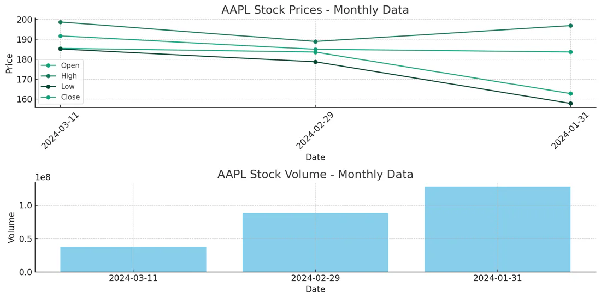

# Data Visualization

In this final stage, you will empower the assistant to create visual representations of stock market data through plots and charts. Your task involves creating prompts that direct the assistant in generating visualizations, handling the resulting image file by saving it as a binary file, and finally outputting the unique file ID associated with the generated image.

## Objectives

With the help of Code Interpreter tool from the previous stage, it's pretty easy to create visuals. Here's how you would go about it:

### 1. Write Prompt for Visuals
Design prompts that instruct the AI assistant on how to create plots and charts from the stock market data:

```
Retrieve and visualize the monthly time series data for the stock symbol 'AAPL' for the latest 3 months.
```

### 2. Handle Generated File
Code Interpreter tool will generate a file and you can access the generated file ID from the thread messages content. Print the file ID and write the binary file as an image to store the generated visualization. 

**File Requirements:**
- The file name should be `stock-image.png`


### Examples

#### Example 1: Sample Execution Log
```
Matching `stock_analyzer_assistant` assistant found, using the first matching assistant with ID: asst_ixRCiWze9eII7yiW48BGfysf
Thread created with ID: thread_frQge4YOCEeiW9buF0GsYq43
Run initiated with ID: run_YjUdZgr2NqRDfgfxIhwGDHKV
Waiting for response from `stock_analyzer_assistant` Assistant. Elapsed time: 0.00 seconds
Tool call with ID and name:  call_k1AH8gXA5fzPHn4GKtIMK2ja retrieve_stock_data
Waiting for response from `stock_analyzer_assistant` Assistant. Elapsed time: 20.89 seconds
Done! Response received in 41.14 seconds.

# Messages
user: Retrieve and visualize the monthly time series data for the stock symbol 'AAPL' for the latest 3 months.
assistant: The monthly time series data for the stock symbol 'AAPL' for the latest 3 months is as follows:

1. March 2024
   - Open: $185.49
   - High: $198.73
   - Low: $185.18
   - Close: $191.73
   - Volume: 37,816,338

2. February 2024
   - Open: $183.63
   - High: $188.95
   - Low: $178.75
   - Close: $185.03
   - Volume: 88,679,550

3. January 2024
   - Open: $162.83
   - High: $196.90
   - Low: $157.88
   - Close: $183.66
   - Volume: 128,121,557

Let's visualize this data to better understand the stock performance over the last 3 months.
assistant: file-7b4Iwb5Wl0UCECP3qM8P8enQ

Step: step_GUXryR7yNI5KRPMLNZDWqCGR
Step: step_ofRowtQgcTAsQcXOaRjHDyjv
Step: step_oUlWH9ZeSNBftODNf6XJajBU
Step: step_GfRtrneGxBwmKOiUw5pruXXZ
```

#### Example 2: The Generated Image:  


